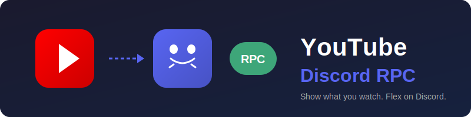

<p align="center">
  
</p>

<h3 align="center">Show what you're watching on YouTube — as your Discord Rich Presence.</h3>

<p align="center">
  <a href="https://github.com/SirYadav1/youtube-discord-rpc/stargazers"></a>
  <a href="https://github.com/SirYadav1/youtube-discord-rpc/network/members"></a>
  <a href="https://github.com/SirYadav1/youtube-discord-rpc/issues"></a>
  <a href="https://github.com/SirYadav1/youtube-discord-rpc/pulls"></a>
  <a href="https://github.com/SirYadav1/youtube-discord-rpc/blob/main/LICENSE"></a>
  
</p>

<p align="center">
  
  
  
  
  
</p>

<br>

<table align="center">
  <tr>
    <td align="center">
      <b>Features</b><br><br>
      <code>• Video title & channel</code><br>
      <code>• Video thumbnail</code><br>
      <code>• Live elapsed / total time</code><br>
      <code>• Watch Video button</code><br>
      <code>• Auto-updates in 1s</code>
    </td>
    <td align="center" width="100">
      &nbsp;&nbsp;&nbsp;&nbsp;&nbsp;&nbsp;&nbsp;&nbsp;&nbsp;&nbsp;
    </td>
    <td align="center">
      <b>Requirements</b><br><br>
      <code>• Python 3.8+</code><br>
      <code>• Discord Desktop App</code><br>
      <code>• Chrome / Firefox</code><br>
      <code>• pip install websockets pypresence</code>
    </td>
  </tr>
</table>

<br>

---

## ⚡ Quick Start

### 1. Install dependencies

```bash
pip install websockets pypresence
```

### 2. Create `host/config.json`

```json
{
  "client_id": "YOUR_DISCORD_CLIENT_ID"
}
```

> Get your Client ID from [Discord Developer Portal](https://discord.com/developers/applications)

### 3. Start the server

```bash
# Windows: double-click start-server.bat

# Linux / macOS:
cd host
python rpc_server.py
```

### 4. Load the extension

| Browser | Steps |
|---------|-------|
| **Chrome** | `chrome://extensions` → Developer mode ON → Load unpacked → select `extension/` |
| **Firefox** | `about:debugging` → Load Temporary Add-on → select `manifest.json` |

### 5. Play a video

Open YouTube, play anything — your Discord status updates automatically.

---

## 🔧 How It Works

```
┌─────────────┐    ┌─────────────┐    ┌─────────────┐    ┌─────────┐
│  YouTube    │───▶│  content.js │───▶│  background │───▶│  Server │───▶ Discord
│  Page       │    │  (detect)   │    │  (bridge)   │    │  (RPC)  │
└─────────────┘    └─────────────┘    └─────────────┘    └─────────┘
```

Everything runs **locally** on your machine. No data is sent anywhere.

---

## 📁 Project Structure

```
youtube-discord-rpc/
├── extension/
│   ├── manifest.json       # Extension config
│   ├── content.js          # Detects YouTube video info
│   ├── background.js       # WebSocket connection manager
│   ├── popup.html/css/js   # Extension popup UI
│   └── icons/              # Extension icons
├── host/
│   ├── rpc_server.py       # WebSocket + Discord RPC server
│   ├── config.json.example # Config template
│   └── config.json         # Your config (gitignored)
├── assets/
│   └── logo.svg            # Project logo
├── start-server.bat        # Windows launcher
├── LICENSE
└── README.md
```

---

## 🐛 Troubleshooting

<details>
<summary><b>RPC not showing on Discord</b></summary>
<br>

- Make sure `rpc_server.py` is running
- Make sure Discord desktop app is open
- Check extension popup — status should say "Connected"
</details>

<details>
<summary><b>Extension says "Disconnected"</b></summary>
<br>

- Start the Python server first
- Click **Refresh** in the extension popup
</details>

<details>
<summary><b>"Discord not connected" in terminal</b></summary>
<br>

- Start Discord first, then run the server
- The server retries automatically every 30 seconds
</details>

<details>
<summary><b>Thumbnail shows but title is wrong</b></summary>
<br>

- Reload the YouTube page
- The extension will re-detect everything
</details>

---

## 📬 Contact

<p align="center">
  <a href="https://t.me/Siryadav">
    
  </a>&nbsp;
  <a href="https://x.com/siryadav0">
    
  </a>&nbsp;
  <a href="mailto:osamabinladenfromindia@gmail.com">
    
  </a>&nbsp;
  <a href="https://paypal.me/SundramYadav4601">
    
  </a>
</p>

---

## 📄 License

[MIT](LICENSE) — use it however you want.
